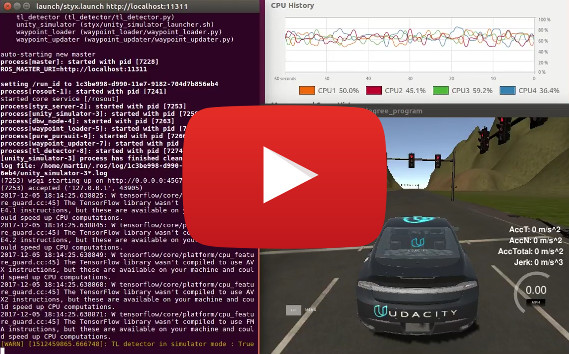

## TAG Team - Capstone Project - Udacity Self-Driving Car Engineer

This repository contains the results of TAG Team's capstone project for the [Udacity Self-Driving Car Engineer Nanodegree Program](https://www.udacity.com/drive). The project utilizes Ubuntu Linux 16.04 with ROS Kinetic ([Robot Operating System](https://www.ros.org)), the [Udacity System Integration Simulator](https://github.com/udacity/CarND-Capstone/releases). Skeleton code cloned from Udacity (https://github.com/udacity/CarND-Capstone), code written in C++ and Python to provide a system integration solution to the self-driving car problem. The code developed will be tested on Udacity's real-world test vehicle (a Lincoln MKZ named "Carla").

----

#### Current simulator performance on YouTube:
[](https://www.youtube.com/watch?v=tCO0b6EGY7o)

----

## Team Members
|     Name    |      Location     |     LinkedIn     |          |
|-------------|-------------------|------------------|----------|
| Martin Hintz <br>(**Team Lead**) | Adelaide, Australia | [linkedin.com/in/martinhintz](https://www.linkedin.com/in/martinhintz/) |  |
| Troy Tobin | Adelaide, Australia | [linkedin.com/in/troy-tobin-36a3b366](https://www.linkedin.com/in/troy-tobin-36a3b366/) |  |
| Jefferson Hernández | Colombia |  |
| Bogdan Oloeriu | Liège Area, Belgium | [linkedin.com/in/bogdan-oloeriu-25291868](https://www.linkedin.com/in/bogdan-oloeriu-25291868/) |  |
| Charan Karthikeyan | Pittsburgh, USA | [linkedin.com/in/charan-karthikeyan-11b71b104](https://www.linkedin.com/in/charan-karthikeyan-11b71b104/) |  |

----

## TAG Team Repo Status
Working:
* Car is driving along the waypoints
* Car keeps reasonable speed
* TL detector publishes next red traffic light
* TL state is currently taken from simulator ground truth
* Stopping at red TLs (brake torque corrected - works with simple step function)
* Waypoint/TL ID handling for 2nd lap completed (although it's not required as car is meant to stop after one lap).
* Simulator + ROS also running on slower machines. Achieved by reducing the queue size of current_pose topic to 1, so the waypoint updater is only processing the latest message.
* TL classifier (from Bogdan, commit Dec 1, 56ac2b7...)
* Fine tuning, smoothing of acceleration and braking and maybe steering. Looks like car is within all parameter limits. Needs confirmation from reviewer.

To be done:
* -/-

Open questions:
1. What's the distance car -> next TL we want to use to engage the TL classifier? **Answer:** The distance is calculated according to the car's proposed linear velocity: ```int(math.ceil(0.5 * linear_v * linear_v))```. For the simulator, the distance is 62, for site mode it's 4.

----

## Udacity Project Instructions
This is the project repo for the final project of the Udacity Self-Driving Car Nanodegree: Programming a Real Self-Driving Car. For more information about the project, see the project introduction [here](https://classroom.udacity.com/nanodegrees/nd013/parts/6047fe34-d93c-4f50-8336-b70ef10cb4b2/modules/e1a23b06-329a-4684-a717-ad476f0d8dff/lessons/462c933d-9f24-42d3-8bdc-a08a5fc866e4/concepts/5ab4b122-83e6-436d-850f-9f4d26627fd9).

### Native Installation

* Be sure that your workstation is running Ubuntu 16.04 Xenial Xerus or Ubuntu 14.04 Trusty Tahir. [Ubuntu downloads can be found here](https://www.ubuntu.com/download/desktop).
* If using a Virtual Machine to install Ubuntu, use the following configuration as minimum:
  * 2 CPU
  * 2 GB system memory
  * 25 GB of free hard drive space

  The Udacity provided virtual machine has ROS and Dataspeed DBW already installed, so you can skip the next two steps if you are using this.

* Follow these instructions to install ROS
  * [ROS Kinetic](http://wiki.ros.org/kinetic/Installation/Ubuntu) if you have Ubuntu 16.04.
  * [ROS Indigo](http://wiki.ros.org/indigo/Installation/Ubuntu) if you have Ubuntu 14.04.
* [Dataspeed DBW](https://bitbucket.org/DataspeedInc/dbw_mkz_ros)
  * Use this option to install the SDK on a workstation that already has ROS installed: [One Line SDK Install (binary)](https://bitbucket.org/DataspeedInc/dbw_mkz_ros/src/81e63fcc335d7b64139d7482017d6a97b405e250/ROS_SETUP.md?fileviewer=file-view-default)
* Download the [Udacity Simulator](https://github.com/udacity/CarND-Capstone/releases/tag/v1.2).

### Docker Installation
[Install Docker](https://docs.docker.com/engine/installation/)

Build the docker container
```bash
docker build . -t capstone
```

Run the docker file
```bash
docker run -p 4567:4567 -v $PWD:/capstone -v /tmp/log:/root/.ros/ --rm -it capstone
```

### Usage

1. Clone the project repository
```bash
git clone https://github.com/udacity/CarND-Capstone.git
```

2. Install python dependencies
```bash
cd CarND-Capstone
pip install -r requirements.txt
```
3. Make and run styx
```bash
cd ros
catkin_make
source devel/setup.sh
roslaunch launch/styx.launch
```
4. Run the simulator

### Real world testing
1. Download [training bag](https://drive.google.com/file/d/0B2_h37bMVw3iYkdJTlRSUlJIamM/view?usp=sharing) that was recorded on the Udacity self-driving car (a bag demonstraing the correct predictions in autonomous mode can be found [here](https://drive.google.com/open?id=0B2_h37bMVw3iT0ZEdlF4N01QbHc))
2. Unzip the file
```bash
unzip traffic_light_bag_files.zip
```
3. Play the bag file
```bash
rosbag play -l traffic_light_bag_files/loop_with_traffic_light.bag
```
4. Launch your project in site mode
```bash
cd CarND-Capstone/ros
roslaunch launch/site.launch
```
5. Confirm that traffic light detection works on real life images
